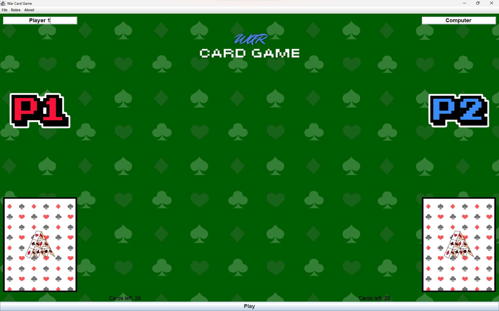
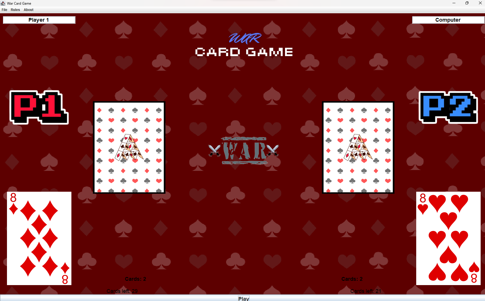

CardGame
============

This is simple card game. It is a university homework focused on working in team and writing full-featured game in Java and ~~Java bindings to WebView~~ Swing.

> If you are not our professor, or other student, you wont find anything useful here.
## Rules
- The objective of the game is to win all of the cards.
- The deck is divided evenly and randomly among the players, giving
each a down stack. In unison, each player reveals the top card of
their deck -this is a "battle"- and the player with the higher card takes
both of the cards played and moves them to their stack. Aces are
high, and suits are ignored.
- If the two cards played are of equal value, then there is a "war". Both
players place the next 2 cards from their pile face down and then
another card face-up. The owner of the higher face-up card wins the
war and adds all the cards on the table to the bottom of their deck. If
the face-up cards are again equal then the battle repeats with another
set of face-down/up cards. This repeats until one player's face-up
card is higher than their opponent's.
- If a player runs out of cards during a war, that player immediately
loses. In others, the player may play the last card in their deck as
their face-up card for the remainder of the war or replay the game
from the beginning.
- The game will continue until one player has collected all of the cards.

## Features
- ~~Modern UI enchanced with animations~~
- ~~Multiplayer~~
- Crossplatform
- ~~Several gamemodes~~
- Save and load progress

## Showcase

  
&nbsp; &nbsp; &nbsp; &nbsp;
  

## Setup
1. Install [devbox](https://www.jetify.com/devbox/docs/installing_devbox/)
2. Clone this repo to your desktop and run `devbox shell` to enter deterministic development shell with all dependencies and packages installed.

## Usage
After you clone this repo to your desktop, go to its root directory and run `just` to build project and run it.

For other functionality run `just -l`

## License

This project is licensed under the terms of the **MIT** license.
